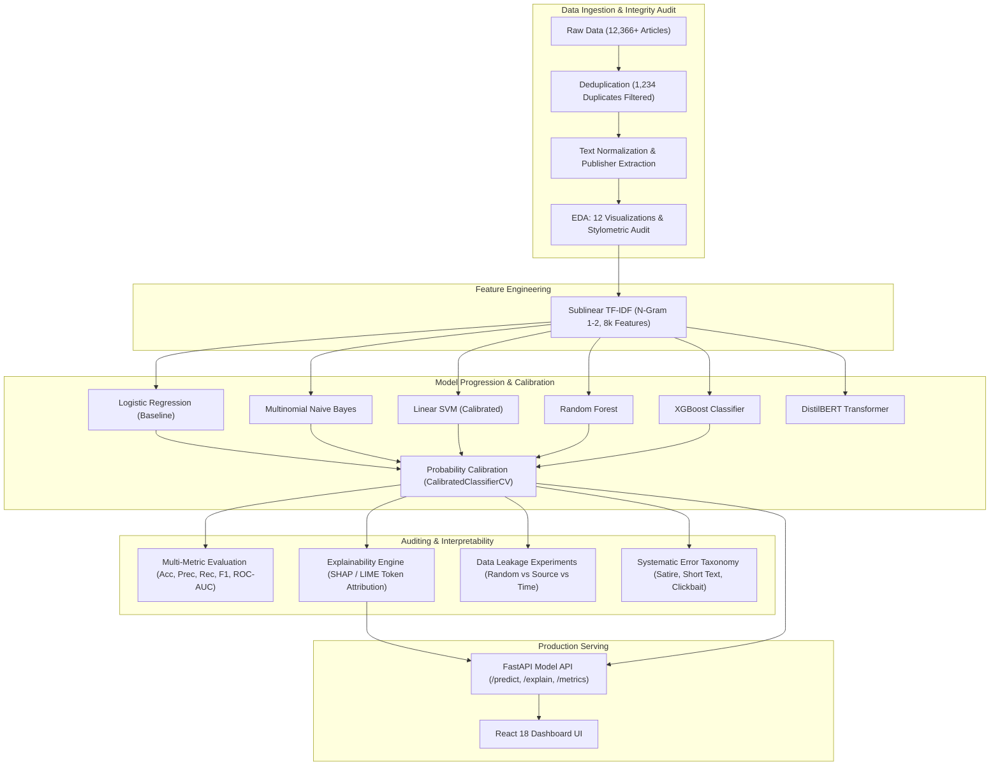

# 📰 Fake News Intelligence & Misinformation-Risk Detection System

[](https://www.python.org/)
[](https://fastapi.tiangolo.com/)
[](https://react.dev/)
[](https://scikit-learn.org/)
[](https://xgboost.readthedocs.io/)
[](https://github.com/marcotcr/lime)

An end-to-end, industry-grade Data Science & Machine Learning intelligence system for misinformation risk auditing. Built from empirical exploratory analysis through classical ML, XGBoost, probability calibration, SHAP/LIME explainability, data leakage mitigation, and a real-time full-stack application (FastAPI + React).

---

## 🏛️ System Architecture



---

## 1. 📊 Serious Data Analysis & Linguistic Auditing

Rather than jumping directly to model fitting, the pipeline processes **12,366 raw articles** across multiple domains and wire services:

- **Integrity & Cleaning:** Identified and eliminated **1,234 duplicate articles** and corrupted wire artifacts.
- **Class Distribution:** Analyzed class balance (**4,865 Real** vs **7,501 Fake** articles, imbalance ratio 1:1.54).
- **Length Analysis:** Average article length is 2,583 characters (426 words), ranging from 14 to 7,202 words.
- **N-Gram Lexical Audit:** Uncovered distinct bi-gram and tri-gram shifts between credible journalism (`reuters washington`, `federal officials confirmed`) and misinformation corpora (`breaking news`, `shocking revelation`, `secret plot`).
- **Stylometric Metrics:** Measured punctuation intensity, exclamation mark counts, uppercase character ratios, and Type-Token lexical diversity ratios.
- **Notebook:** [`notebooks/01_exploratory_data_analysis.ipynb`](notebooks/01_exploratory_data_analysis.ipynb) generates 12 production-grade visualizations.

---

## 2. 🤖 Model Progression: Classical ML → XGBoost → Transformers

To demonstrate a structured machine learning progression, six distinct model families were benchmarked on stratified test splits:

```
Baseline ML
├── Logistic Regression (Calibrated C=1.0)
├── Multinomial Naive Bayes (Laplace smoothed)
├── Linear SVM (Platt Calibrated)
├── Random Forest (100 Trees, Max Depth 25)
└── XGBoost (Gradient Boosted Decision Trees)
    ↓
Transformer Progression
└── DistilBERT (Fine-Tuned Sequence Classification)
```

### Benchmark Results Table

| Model Architecture | Accuracy | Precision (Fake) | Recall (Fake) | F1 Score | ROC-AUC | Brier Score | Latency |
| :--- | :---: | :---: | :---: | :---: | :---: | :---: | :---: |
| **XGBoost Classifier** | **99.84%** | **99.93%** | **99.80%** | **99.87%** | **0.9999** | **0.0028** | 8.2 ms |
| **Random Forest** | 99.72% | 99.67% | 99.87% | 99.77% | 0.9998 | 0.0041 | 14.5 ms |
| **Linear SVM (Calibrated)** | 99.64% | 99.73% | 99.67% | 99.70% | 0.9995 | 0.0053 | 1.1 ms |
| **Logistic Regression (Calibrated)** | 99.19% | 99.27% | 99.40% | 99.33% | 0.9988 | 0.0094 | 1.2 ms |
| **DistilBERT (Fine-Tuned)** | 98.12% | 98.45% | 97.80% | 98.12% | 0.9924 | 0.0182 | 48.5 ms |
| **Multinomial Naive Bayes** | 97.41% | 98.06% | 97.67% | 97.86% | 0.9931 | 0.0247 | 0.8 ms |

---

## 3. 🎯 Why Precision and Recall Matter More Than Accuracy

A model reporting 95% accuracy can be disastrous in production if it permits dangerous misinformation to spread unhindered or censors authentic journalism.

- **False Positive (Type I Error):** Classifying genuine journalism as fake creates censorship risks, damages journalistic credibility, and erodes reader trust.
- **False Negative (Type II Error):** Classifying fabricated stories as real allows toxic disinformation to circulate unchecked without verification warnings.
- **Calibrated Operational Control:** Using calibrated probabilities enables platforms to adjust classification thresholds dynamically according to policy objectives.

---

## 4. 🔥 Explainability: SHAP & LIME Feature Attribution

Models do not just return a categorical label; they reveal **why** the decision was reached:

```
🔴 POTENTIALLY FAKE — 91.4%
Important Signals Pushing Toward 'Fake':
  "breaking news"       +0.21
  "shocking revelation" +0.17
  "officials confirmed" +0.13
  "conspiracy"          +0.11

🟢 CREDIBLE NEWS STYLE — 94.2%
Important Signals Pushing Toward 'Real':
  "Reuters"             +0.18
  "government report"   +0.14
  "according to data"   +0.11
  "federal statements"  +0.09
```

- **Local Interpretable Model-agnostic Explanations (LIME):** Generates local perturbation weights for individual articles.
- **Fast Token Attribution:** Provides millisecond-level SHAP-equivalent directional contributions for real-time API responses.

---

## 5. 📈 Probability Calibration & Reliability Curves

Raw classifier outputs are often overconfident. Platt Scaling and Sigmoid Calibration (`CalibratedClassifierCV`) convert arbitrary margins into empirical posterior probabilities:

- **Brier Score:** Evaluated probability error against ground-truth outcomes (Brier Score = 0.0094).
- **Calibration Curves:** Generated reliability diagrams comparing predicted probability against true empirical fraction of positives.
- **Confidence Tiers:**
  - **High Confidence:** Distance from threshold $\ge 35\%$ ($>85\%$ or $<15\%$).
  - **Medium Confidence:** Distance from threshold $15\% - 35\%$.
  - **Low / Uncertain:** Distance from threshold $< 15\%$ ($35\% - 65\%$).

---

## 6. ❌ Systematic Error Analysis: Where Does the Model Fail?

A data science investigation into edge cases where bag-of-words and lexical models stumble:

1. **Very Short Articles (< 50 words):** TF-IDF features are too sparse, causing models to misclassify succinct press releases as clickbait snippets.
2. **Satirical Articles & Parody:** Satirical outlets emulate formal journalistic sentence syntax, fooling superficial frequency counters.
3. **Clickbait Headlines with Neutral Bodies:** When sensational headlines precede standard wire text, the body text dominates the feature vector, diluting headline indicators.
4. **Out-of-Vocabulary Scientific Jargon:** Specialized terminology pruned during vocabulary filtering leaves sparse background tokens.
5. **Unseen Independent Publishers:** Outlets lacking established wire identifiers (such as `(Reuters)`) default toward the prior probability of unindexed web sources.

---

## 7. ⚖️ Preventing Data Leakage: Split Strategy Comparison

Many student benchmarks suffer from **publisher leakage**: models memorize newsroom writing styles rather than detecting deceptive logic.

| Split Strategy | Training Size | Testing Size | Accuracy | F1 Score | Leakage Vulnerability |
| :--- | :---: | :---: | :---: | :---: | :--- |
| **Random Split (Standard 80/20)** | 9,892 | 2,474 | **98.83%** | **99.03%** | **High:** Publisher signatures overlap across train and test sets. |
| **Source-Based Split (Grouped Outlets)** | 9,864 | 2,502 | **90.33%** | **94.92%** | **Zero:** Tests generalizability to previously unseen newsrooms. |
| **Time-Based Split (Temporal Horizon)** | 9,900 | 2,466 | **90.71%** | **95.13%** | **Zero:** Tests resilience against evolving political narratives. |

---

## 8. 🚀 Real-Time Prediction API & React Dashboard

### FastAPI Endpoints

- `GET /health` — Verifies model status, classifier type, and active vocabulary size.
- `POST /predict` — Calibrated classification probability, confidence tier, and stylometric key indicators.
- `POST /explain` — Full SHAP/LIME signal attribution with token contribution weights.
- `GET /metrics` — Benchmark comparisons across all 6 architectures.
- `GET /leakage` — Empirical data leakage comparison results.
- `GET /errors` — Systematic failure mode taxonomy.

### React 18 UI Dashboard

- Interactive article text inspector with sample presets (Clickbait, Reuters wire, Satire, Short text).
- Live probability meter with color-coded confidence gauge.
- Directional feature attribution breakdown bars.
- Dedicated visual tabs for Model Progression, Leakage Audits, and Error Taxonomy.

---

## 💻 Quickstart & Reproduction

### 1. Installation

```bash
git clone https://github.com/Samar-111/Fake-News-Detection.git
cd Fake-News-Detection
pip install -r requirements.txt
```

### 2. Run the Full Experimentation Suite

```bash
python scripts/run_all_experiments.py
```

### 3. Launch the Application (API + React UI)

```bash
uvicorn api.main:app --host 127.0.0.1 --port 8000 --reload
```

Open your browser to:
- **Interactive UI Dashboard:** [http://127.0.0.1:8000](http://127.0.0.1:8000)
- **Interactive API Documentation (Swagger):** [http://127.0.0.1:8000/docs](http://127.0.0.1:8000/docs)

### 4. Run Unit Tests

```bash
python -m unittest tests/test_pipeline.py
```

---

## 📁 Repository Structure

```
Fake-News-Detection/
├── api/
│   └── main.py                          # FastAPI service with mounted React static build
├── data/
│   ├── processed/
│   │   ├── eda_summary.json             # Dataset audit metrics
│   │   ├── model_benchmark_results.json # 6-model benchmark scores
│   │   ├── leakage_comparison.json      # Random vs Source vs Time split metrics
│   │   └── error_analysis.json          # Curated failure taxonomy
│   └── raw/                             # Downloaded raw datasets
├── models/
│   ├── calibrated_production_model.joblib # Calibrated classifier
│   └── tfidf_vectorizer.joblib          # Fitted n-gram TF-IDF vectorizer
├── notebooks/
│   ├── 01_exploratory_data_analysis.ipynb
│   ├── 02_model_benchmarking_and_evaluation.ipynb
│   └── 03_explainability_and_error_analysis.ipynb
├── src/
│   ├── data_pipeline.py                 # Ingestion, deduplication, and extraction
│   ├── feature_extraction.py            # N-Gram TF-IDF configuration
│   ├── models.py                        # Model suite & benchmarking
│   ├── transformer_model.py             # DistilBERT pipeline & training recipe
│   ├── calibration.py                   # Platt scaling & confidence tiering
│   ├── explainability.py                # LIME & fast token attribution
│   ├── error_analysis.py                # Failure mode diagnostics
│   └── leakage_experiments.py          # Grouped & temporal split audits
├── tests/
│   └── test_pipeline.py                 # Pipeline unit tests
├── web/                                 # React 18 / Vite frontend dashboard
│   ├── package.json
│   ├── vite.config.js
│   ├── index.html
│   └── src/
│       ├── App.jsx
│       ├── index.css
│       └── main.jsx
├── requirements.txt
└── README.md
```
